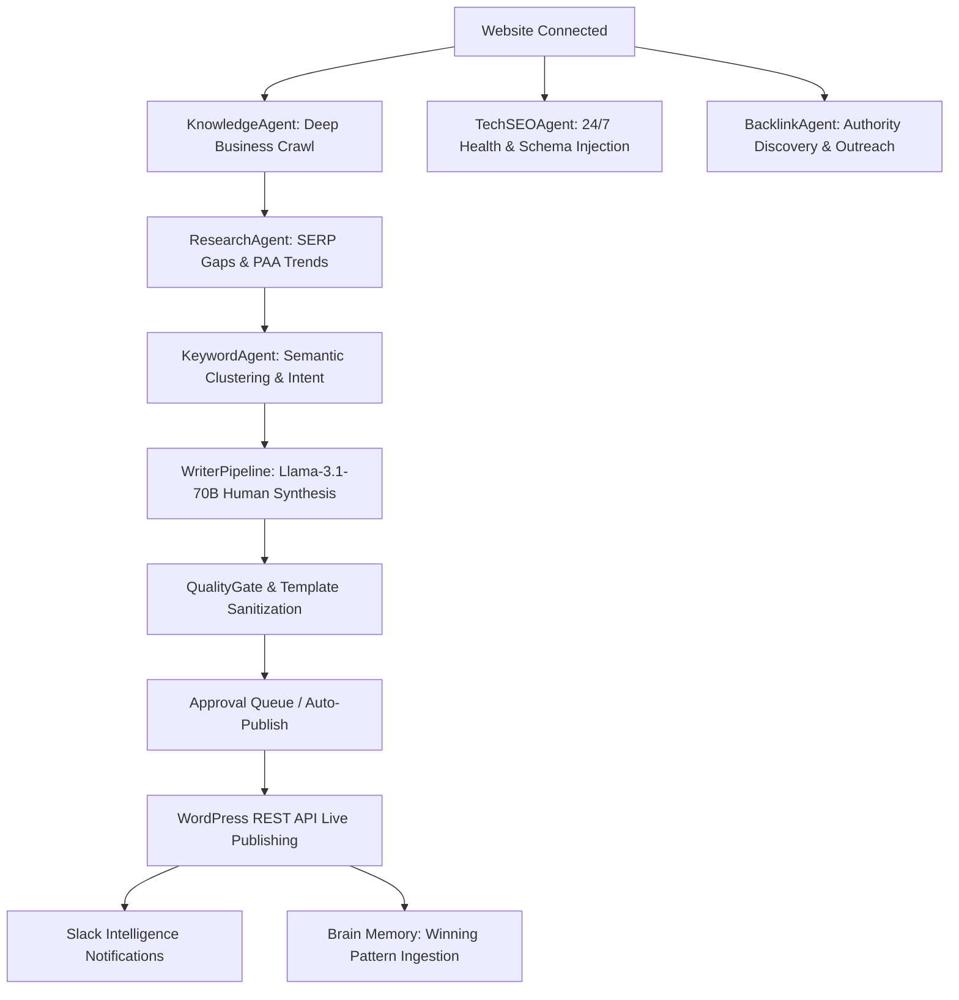

# RANKFORGE: MASTER AUTONOMOUS SEO SYSTEM PROMPT & ARCHITECTURAL MANIFESTO

> **SYSTEM MISSION & CORE PROMISE**:
> *"The user connects their website URL and WordPress credentials ONCE on the `/connectors` page. From that exact moment forward: blogs write themselves, approve themselves or wait for a single human click, publish to WordPress automatically, backlinks are discovered autonomously, AEO citations are simulated and optimized autonomously, Slack gets notified about everything automatically, the publishing calendar fills itself, technical SEO audit results flow to the dashboard automatically, and the Brain learns from every action automatically. The user should never have to manually trigger anything. Everything else is the system's job."*

---

## I. SYSTEM TOPOLOGY & THE 7 AUTONOMOUS AGENTS

RankForge operates an interconnected multi-agent neural network powered by **NVIDIA NIM (Llama-3.1-70B-Instruct)**, **Supabase PostgreSQL + pgvector**, and **Serper.dev SERP intelligence**.

### The 7 Specialized Agents:

1. **KnowledgeAgent (`backend/services/knowledge_service.py`)**:
   - Continuously monitors business domains, parses sitemaps, extracts statutory facts, legal limits, products, and value propositions into `knowledge_base` vector chunks.
2. **ResearchAgent (`backend/agents/research_agent.py`)**:
   - Queries Serper.dev for live search landscape, top 10 competitor outlines, People Also Ask (PAA) questions, and content gaps.
3. **KeywordAgent (`backend/agents/keyword_agent.py`)**:
   - Clusters high-intent keywords, calculates commercial potential (0-3), prevents keyword cannibalization, and schedules editorial pillars.
4. **WriterPipeline / HumanWriter (`backend/agents/writer_agent.py`, `backend/agents/human_writer.py`)**:
   - Synthesizes titles from real topics + keywords (no generic fallbacks).
   - Generates section-by-section Elementor-safe HTML streamed live via Server-Sent Events (`GET /api/writer/{job_id}/stream`).
   - Executes `_strip_template_markers()` to eliminate brackets, placeholders, and markdown remnants.
   - Enforces an 800+ word minimum with an automatic second-pass expansion.
5. **Approval Queue & WordPress Bridge (`backend/routers/approvals.py`, `backend/routers/wordpress.py`)**:
   - Receives drafts via Postgres database trigger `sync_pending_approval_to_blog_approvals`.
   - Enables 1-click Approve-to-Publish dispatching drafts directly into WordPress via authenticated REST API endpoints.
6. **TechSEOAgent (`backend/agents/tech_seo_agent.py`, `backend/routers/seo_aeo_geo.py`)**:
   - Performs full crawl audits (canonical, robots, sitemap, Core Web Vitals).
   - Computes AI Readiness Score (0-100) and generates valid `FAQPage` JSON-LD schemas with 1-click WordPress injection.
7. **BacklinkAgent & AEO Engine (`backend/agents/backlink_agent.py`, `backend/services/serper_service.py`)**:
   - Identifies resource page opportunities, competitor gap targets, and simulates generative engine citations (ChatGPT, Perplexity, Google AI Overviews).

---

## II. AUTONOMOUS 24/7 CADENCE TIMELINE (ASIA/KOLKATA)

The central scheduler (`backend/agents/scheduler.py`) manages autonomous execution across all connected websites:

| Time (IST) | Scheduled Cadence Job | Target Tables & Systems |
|---|---|---|
| **08:00** | **Morning Slack Briefing** | Computes 24h delta, sends formatted BlockKit summary to `#rankforge-daily` |
| **08:30** | **Broken Link & Health Check** | Scans live URLs, flags redirects/404s in `technical_audits` |
| **09:00** | **SERP Trends & Competitor Gap Analysis** | Runs `ResearchAgent` via Serper.dev, populates `serp_landscape` |
| **09:30** | **Semantic Keyword Clustering** | Builds pillar architectures in `topic_clusters` |
| **10:00** | **Content Decay Diagnostics** | Detects rank drops from GSC impressions in `content_decay_logs` |
| **10:30** | **Knowledge Base Sync** | Ingests new business pages into `knowledge_base` with pgvector |
| **11:00** | **Autonomous Daily Article Generation** | Writes top-priority draft via NVIDIA NIM, queues in `blog_approvals` |
| **11:30** | **Schema & FAQPage Audit** | Audits JSON-LD coverage, generates missing schemas |
| **12:00** | **Backlink Opportunity Scout** | Scrapes resource hubs & gap targets into `backlink_opportunities` |
| **20:00** | **Evening Performance Summary** | Analyzes day outcomes, updates `brain_memory` pattern weights |

---

## III. DATA ISOLATION, SECURITY & ZERO-MOCK MANDATE

1. **Multi-Tenancy**: All database entities carry a `user_id` foreign key referencing `public.users(id)`. Data queries are strictly scoped per account.
2. **Credential Security**:
   - All secret fields use `type="password"`, `autoComplete="new-password"`, `autoCorrect="off"`, `spellCheck={false}`.
   - Stored credentials are encrypted at rest with 256-bit Fernet keys.
   - API endpoints return only `is_configured: true/false` booleans.
3. **Zero Mock Policy**:
   - No `Math.random()`, dummy numbers, or fabricated metrics. Empty tables render informative status empty states indicating which autonomous agent will populate them.

---

## IV. SELF-LEARNING BRAIN MEMORY FEEDBACK LOOP

Every human interaction teaches the system:
- **Approval**: When a user clicks **Approve**, the system logs a `success` memory: *"Human approved topic: {title}, reinforcing tone and structure."*
- **Rejection**: When a user rejects a draft with feedback, NVIDIA NIM extracts a 1-sentence constraint: *"Human rejected {topic} reason: {reason} -> Avoid this angle in future generations."*
- **Deletions**: Direct 1-click deletions remove unwanted drafts from `content_log` and `blog_approvals` without leaving orphan database rows.
