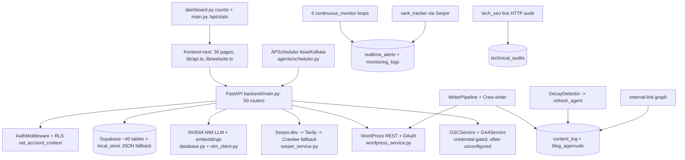
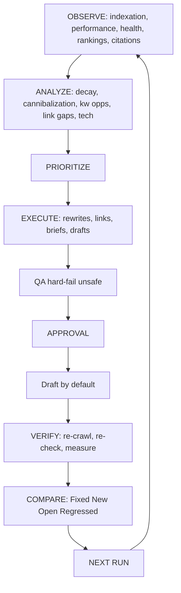
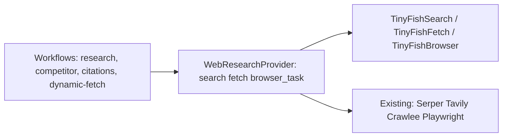
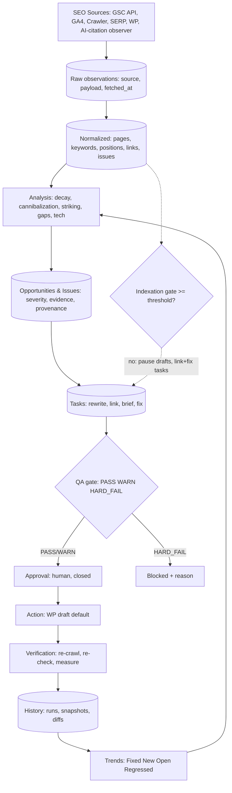

# RankForge SEO Automation Audit

**Date:** 2026-09-11 · **Mode:** read-only, evidence-based · **Repo:** `C:\Users\nikhil\Desktop\seo-agent-system`
**Principle applied:** a feature counts as implemented only when a real end-to-end path (UI → route → service → DB/external API → persisted result → consumer) can be traced in code. UI cards, types, routes, and placeholders alone do not count.

---

## Executive Summary

**Direct assessment:** RankForge is a genuinely large, partially working SEO *content-operations* system — not yet a trustworthy SEO *outcomes* system. Content generation, knowledge grounding, WordPress drafting, tech auditing, decay detection, rank tracking, SERP research, and approval plumbing all have real code behind them. But the product's headline story (dashboard, health scores, readiness badges, run summaries) is dominated by **content-production metrics and hardcoded healthy defaults**, while the SEO-outcome layer — indexation, impressions/clicks/CTR/position, striking distance, history diffs, cannibalization, indexation-gated publishing — is **missing, broken, or mocked**.

**What is genuinely working (traced end-to-end):**

- FastAPI backend (`backend/main.py`) with 50 routers, JWT auth (`middleware/auth.py`), rate-limit/CORS/security/sanitize middleware, multi-tenant `set_account_context` (`database.py:72`).
- Supabase persistence across ~40+ tables (`supabase_master_complete.sql`, `backend/supabase_*.sql`) + JSON local-store fallback (`services/local_store.py`).
- NVIDIA NIM LLM + embeddings with retry/fallback and availability tracking (`database.py:387-471`, `services/nim_client.py`).
- Serper.dev SERP integration with Tavily + Crawlee fallback, honest empty on failure (`services/serper_service.py:139-230`).
- Live tech-SEO HTTP audit: base page + `/robots.txt` + sitemap + up to 10 subpages, persisted to `technical_audits` (`routers/tech_seo.py:100-310`).
- Decay detection on real GSC period comparison (>15% → log, warning/major severity) + diagnosis + refresh pipeline + approve-publish (`services/decay_detector_service.py:35-181`, `routers/decay.py`).
- Internal-link graph from real sitemap + Crawlee + networkx PageRank (`routers/links.py:20`, `services/internal_link_service.py`).
- Serper-based rank tracking with position normalization and ≥5-position alerts (`services/rank_tracker.py:148-198`).
- Two real writer pipelines (legacy `WriterPipeline` 12-phase/12-expert in `agents/writer_agent.py`; CrewAI 3-agent in `agents/crew_blog_writer.py`) with KB grounding aborts, denylist, humanizer, expert reviews, `content_pipeline_logs` + `content_expert_reviews` persistence.
- KB hybrid retrieval grounding (`services/knowledge_service.py`), tone profiles (`tone_profiles`), brand-brain recall in `human_writer.py:101-403`.
- WordPress REST draft-first publishing (`services/wordpress_service.py:440-443,738,806`), OAuth token flow, approval routers (`routers/approvals.py`, `routers/proposals.py`), human gate middleware (`middleware/human_gate.py`).
- Single scheduling authority: APScheduler Asia/Kolkata (`agents/scheduler.py:2581-3006`) + 6 continuous-monitor loops (`services/continuous_monitor.py`).
- AEO citation checks, Reddit opportunities, `llms.txt` generation, `ai_visibility` table — real but thin.

**What is currently misleading:**

- Dashboard headline KPIs are `Articles Generated / Pending Approval / SEO Health / Monitored Alerts / Brain Memories / Backlinks` — zero SEO outcomes. No impressions, clicks, CTR, position, indexation %, striking distance, decay, or cannibalization anywhere on the dashboard (`frontend-next/app/page.tsx:757-798`, `backend/routers/dashboard.py:258-275`).
- `seo_health_score` defaults to **94** whenever there is no audit or no critical alert (`routers/dashboard.py:176,208-211,264`; `main.py:679,706`). Empty state renders as healthy.
- `monitored_alerts` has a floor of `max(db_count, 6)` (`dashboard.py:176`). Six alerts are invented when the DB is empty.
- `getFallbackDashboardMetrics()` in `frontend-next/app/page.tsx:667-704` returns hardcoded `12/10/2/98` + a fake article with a fake `your-wordpress-site.com` URL + fake ACTIVE agents whenever the API fails — the failure path looks like success.
- Frontend API-route fallbacks (`frontend-next/app/api/**`) return static `accident.innovatcs.com` data; demo-readiness card defaults to five green "pass" chips (`page.tsx:819-825`); `ROILineChart.tsx` is static Mon–Sun dummy data (120/150/180/140/200/170/210); monitoring page hardcodes a `current_position: 11.4 → predicted 16.8` example (`monitoring/page.tsx:315-319`).
- SERP volatility endpoint imports a **nonexistent** `services.monitoring_service` and falls back to hardcoded `{score: 4.2, status: "normal"}` (`routers/serp.py:87-99`).
- GSC keywords router calls `gsc.fetch_keywords()` which **does not exist** on `GSCService` — every call throws, is swallowed, and returns `[]` (`routers/gsc.py:40-49`). Performance rollups over `[]` plus `top_pages` with hardcoded `clicks: 0, impressions: 0` (`gsc.py:77-91`) look like a working report with zero data.
- Internal-link suggestions hardcode `"relevance_score": 0.92` (`routers/links.py:53-58`); decay list defaults missing percents to `24.5` (`routers/decay.py:40`); tech-SEO display defaults to `92` (`routers/tech_seo.py:42`).
- Expert-review LLM failures fall back to `{score: 78, passed: True}` (`writer_agent.py:1995-2026`); all six fact-check sub-verifiers are stubs returning `performed: False / critical_failures: 0` (`writer_agent.py:2211-2235`); the final consistency check always passes (`:2277-2284`).
- Marketing strings in code paths: `"45% faster page-1 indexation"` (`brain_service.py:328`); seeded `"Autonomous SEO Monitoring Active"` alert on boot (`main.py:227-242`).

**Biggest architectural weakness:** there is no normalized SEO-observation layer and no run-history/diff layer. Raw GSC/crawler/SERP data, LLM recommendations, tasks, and results all collapse into the same flat tables (`content_log`, `tasks`, `realtime_alerts`, `monitoring_logs`) with no `previous_run_id`, no snapshots, no Fixed/New/Still-open/Regressed classification. Every job therefore reports a snapshot, never a trend — the OBSERVE→…→COMPARE loop cannot close.

**Biggest SEO weakness:** indexation does not exist as a concept. Zero tables, zero routes, zero calculations, zero tests for indexed-pages/total-pages/indexation-rate. The only "indexation" strings in the backend refer to vector chunks indexed into pgvector. GSC sitemap `valid_count/submitted_count` is fetched by `get_sitemaps()` but never called by any router, job, or dashboard card.

**Biggest publishing risk:** `auto_publish` defaults to **ON** in three places (`agents/scheduler.py:79` fallback `True`; `services/local_store.py:406`; `auto_supabase.py:388 DEFAULT true`) and a 5-minute job (`job_auto_publish_approval`, `scheduler.py:2392-2510`) publishes pending approvals via `publish_post_via_crew(..., auto_publish=True)` whenever the flag row reads true. The two human-gate enforcement points that matter most both have bypasses: `routers/wordpress.py:173-175` falls back to `user_id="human-approved"`; `routers/writer.py:503-509,628-634` falls back to a dummy UUID on gate exception. The frontend's one-click "Run Now" + countdown auto-generation (`page.tsx:411-448`) compounds the blast radius.

**Biggest opportunity:** wire the already-real data services (GSC performance, rank tracker, tech audit, decay, link graph, SERP) into one normalized observation store + one history/diff engine + one indexation gate, and the dashboard can flip from content-count to SEO-outcome with mostly plumbing, not new science.

---

## Current Architecture (as discovered, not as documented)

Execution-path examples (traced):

- **Dashboard:** `app/page.tsx fetchDashboardData` → `GET /api/dashboard/{id}/metrics` → `routers/dashboard.py:127` counts 7 tables in parallel + local-store max + hardcoded 94/6 fallbacks → KPI strip. No GSC, no indexation, no trends in the path.
- **Tech audit:** `tech-seo/page.tsx Run` → `POST /api/tech-seo/{id}/run-audit` → live `aiohttp` fetch of site + robots + sitemap + ≤10 pages → score deductions → `technical_audits` insert → dashboard reads latest row. Real end-to-end. ✅
- **GSC keywords:** `research/page.tsx` → `GET /api/gsc/{id}/keywords` → tries `keyword_opportunities` table → tries nonexistent `fetch_keywords()` → exception → `[]`. Broken path. ❌
- **Decay:** `decay/page.tsx` → `GET /api/decay/{id}/list` reads `content_decay_logs` (written only when GSC connected and >15% decay) → `POST /decay/{id}/refresh` runs `refresh_agent` → `approve-publish` requires human gate → WP publish. Real chain when GSC is connected. ✅/conditional
- **Auto-publish:** scheduler every 5 min → `job_auto_publish_approval` reads `autonomous_settings.auto_publish` → quality gate → `publish_post_via_crew(auto_publish=True)` → WP `status: publish`. Real and dangerous by default. ⚠️
- **Generation:** `writer/page.tsx Generate` → `POST /api/writer/{id}/generate` → KB grounding check (abort <0.45) → SERP top-10 → outline → section writes → 12 experts → humanizer → fact-check stubs → `status: pending_approval` + WP draft → approvals queue. Real, QA-weak. ✅/fragile

### Core entity map

| Entity | Existing? | Location | Used by | Real data? | Problems |
|---|---|---|---|---|---|
| Site/Website | Yes | `websites` table; `models.Website` | everything via `website_id` | Real rows | Frontend fallbacks inject `accident.innovatcs.com` / dummy UUIDs; `local_data` bypasses tenant filter |
| URL/Page | Partial | `pages`, `website_knowledge`, `site_pages`(queried, schema unclear) | crawl, links, tech audit | Real crawled chunks | No canonical page inventory; no indexed-vs-total |
| Keyword / opportunity | Partial | `keyword_opportunities`, `keyword_proposals`, `keywords`(scattered) | gsc/keywords routers | Mixed: DB rows + Serper real + LLM-invented | 3 schemas, no canonical keyword↔page mapping |
| Search performance | Fragile | `analytics_data`, `gsc_metrics`, `content_performance` (queried, sparsely written) | analytics router | Only if external sync ran; else zeros | GSC router broken (`fetch_keywords`); no freshness markers |
| Indexation result | **Missing** | — | — | No | No table, route, job, or test |
| Content / draft | Yes | `content_log`, `blog_approvals` | writer, approvals, dashboard | Real LLM output + WP draft IDs | Status vocab inconsistent (`pending_approval`/`pending`/`draft`/`published`) |
| SEO audit | Partial | `technical_audits`, `audits` | tech-seo page, dashboard health | Real live audit rows | Single latest row consumed; history not diffed |
| Internal-link opp | Partial | `internal_link_index`, `internal_link_suggestions`, `internal_link_graph` | links page | Graph real; suggestion scores hardcoded | No orphan→task pipeline |
| Cannibalization issue | **Missing** | — (`grep cannibal` = 0 hits) | — | No | Only duplicate-title check + overlap skips |
| Content decay issue | Partial | `content_decay_logs`, `content_refresh_queue` | decay page, refresh agent | Real when GSC connected | Default 24.5 stub; no regressed tracking |
| AI citation result | Partial | `ai_visibility`, `reddit_opportunities`, `article_markdown_cache` | aeo router/page | Serper citation checks real | No scheduled history series |
| QA result | Fragile | `quality_checks`, `content_expert_reviews`, `content_pipeline_logs` | writer, approvals | Real scores stored | Fallback-pass + stub verifiers; single-score collapse |
| Publishing job / approval | Yes | `blog_approvals`, `pending_fixes`, `critical_action_logs` | approvals, scheduler, WP | Real state machine | Bypass fallbacks; `auto_publish` default ON |
| Run / run history | **Missing** | `tasks`, `monitoring_logs` abused as proxy | workforce "last run" derivation | Timestamps real, semantics weak | No run IDs, snapshots, diffs, trends |
| Site health result | Partial | `technical_audits.health_score` | dashboard, tech page | Real when audit ran | 94/92 defaults masquerade as results |
| Backlink / prospect | Yes | `backlinks`, `backlink_prospects`, `backlink_opportunities`, `outreach_drafts` | backlinks page, autopilot | Mixed real + prospect | `backlink_opportunities = backlinks_count` alias in dashboard |
| Brain / knowledge | Yes | `brain_memory`, `knowledge_base`, `tone_profiles`, `topic_clusters` | grounding, strategy | Real vectors + hybrid search | No example library; facts lack verification metadata |

---

## SEO Outcome Dashboard Audit (Requirement #1)

**Verdict: PRODUCT PRIORITY PROBLEM. Headline metrics are content-operations, not SEO outcomes.**

What the dashboard surfaces (`routers/dashboard.py:258-275` + `main.py:703-713` + `page.tsx:757-798`):

- `total_articles`, `pending_articles`, `published_articles` ✅ real counts — but these are the **first and largest** KPI cards.
- `seo_health_score` — real when an audit exists, else **94** (`dashboard.py:209,264`). Card turns "green" with no check.
- `monitored_alerts` — `max(db, 6)`. Never zero.
- `memories_count`, `knowledge_count`, `backlinks_count` — operational trivia as KPIs.
- `recent_content`, agent ACTIVE/IDLE/ERROR states, empty `publishing_schedule: []`.

What it does **not** surface anywhere (verified by grep across `frontend-next/app`, `routers/dashboard.py`, `main.py /api/stats`):

- indexed pages / total pages / indexation % — missing entirely.
- impressions, clicks, CTR, average position — missing from both dashboard endpoints (only present in broken `gsc.py` and empty `analytics.py` paths).
- striking-distance keywords — no definition, no count, no list on dashboard. Three inconsistent backend definitions exist off-dashboard: `11–20 & impr≥50` (`daily_search_service.py:58-62`), `10<pos≤20 & impr>100` (`real_data_service.py:164-167`), label-only `≤20` (`rank_tracker.py:284-285`). Nothing is configurable; nothing is surfaced.
- pages gaining/losing visibility, keywords entering/leaving striking distance, traffic trends, decay counts, cannibalization counts, technical-issue counts — all missing.

Counter-consistency bug (P0-class): `/api/stats` (`main.py:589-730`) and `/api/dashboard/{id}/metrics` (`dashboard.py:127`) compute overlapping numbers from **different queries** (content_log status filter vs blog_approvals status; `health_score` latest-audit vs `100 − 10×critical`), with different fallbacks (94 vs 94, alerts floor only in one). Three dashboard-adjacent surfaces can show three different "indexed/health/article" numbers with no source-of-truth marker.

**Restructure to (conceptual, no code changed in this audit):** SEO Health → Indexation → Search Performance → Keyword Opportunities → Issues/Risks → Content Pipeline (operational, last). Gate the whole dashboard on data freshness badges (source + timestamp per card) and empty states that say "Not connected / no data" instead of 94/green.

---

## Workflow Independence Audit (Requirement #2)

| Workflow | Exists? | Independent job? | Trigger | Reads → Writes | History? | Tests? | Verdict |
|---|---|---|---|---|---|---|---|
| A — Indexing Check | No | No | — | — | No | No | 🔴 MISSING |
| B — Search Performance Report | Yes, broken | GSC-gated services, no scheduled report job | On-demand routes | `keyword_opportunities` → aggregation (over `[]`) | No | None for calc | 🟠 FRAGILE |
| C — Site Health | Yes | Yes: `job_tech_seo_audit` 12:00 IST + on-demand | Cron + route | live HTTP → `technical_audits` | Rows persist, never diffed | `test_tech_seo` (endpoint-level) | 🟡 PARTIAL |
| D — On-Page Audit | Partial | No standalone job; embedded in writer phases + `seo_quality_gate.py` | Generation-time | HTML → deductions (100−penalties, pass ≥80) | Per-content only | `test_quality_gate` (4 cases) | 🟡 PARTIAL |
| E — Internal Linking | Partial | Graph builder callable; no scheduled linker job | On-demand route | sitemap+Crawlee → PageRank → suggestions | Graph not versioned | `test_internal_links` (basic) | 🟡 PARTIAL |
| F — Keyword Research | Partial | `job_daily_content_gap` 09:00 + Serper routes | Cron + route | Serper real + LLM invent + fallback templates | Proposals persist; no dedupe vs ranking pages | `test_serper_connector` (mocked) | 🟠 FRAGILE (uncontrolled ideation — see §5) |
| G — Content Pipeline | Yes | Yes: `job_auto_blog_writer_crew`, `job_auto_new_page`, 10-min autonomous loop | Cron + route + frontend timer | KB+SERP → drafts → approvals → WP | `content_pipeline_logs` per content | `test_writer_pipeline/headless/human` | 🟡 PARTIAL (QA fragile, auto-publish risk) |
| H — AI Citation Monitoring | Partial | `job_ai_visibility` 12h + AEO routes | Cron + route | Serper citation checks → `ai_visibility` | Rows persist, no series/diff | None dedicated | 🟡 PARTIAL |
| I — Content Optimization | Partial | `job_content_refresh` 10:30 + decay routes | Cron + route | GSC compare → diagnose → refresh → approve-publish | `content_decay_logs` status-tracked | `test_content_refresh` | 🟡 PARTIAL (decay yes; cannibalization no) |

Cross-cutting gaps for every workflow: no `previous_run_id`, no Fixed/New/Still-open/Regressed output, no standard run summary, no idempotency keys (jobs re-runnable with duplicate side effects — e.g., duplicate drafts on double-fire of the frontend countdown + scheduler), and failure of one (NIM down, GSC unconfigured, WP 401) degrades silently into fallback-pass or empty rather than an explicit FAILED run record.

---

## Data-Driven Content Audit (Requirement #3)

**Verdict: grounding exists but the decision pipeline is incomplete → UNCONTROLLED CONTENT IDEATION in the fallback path.**

Traced decision path for autonomous generation (`agents/scheduler.py` autonomous blog flow + `crew_blog_writer.py` + `human_writer.py`):

1. **Keyword data (real, when keys exist):** `serper_service.search` top-10 + `get_keyword_suggestions`; Tavily/Crawlee fallback. ✅
2. **KB grounding (real, enforced at entry):** `retrieve_relevant_hybrid(keyword, top_k=3)`, abort if avg <0.45–0.55, denylist override needs ≥0.75 (`main.py /generate`, `writer_agent.py:214-257,530-540`). ✅
3. **Existing-page check (weak):** word-overlap skip at >60–70% (`scheduler.py:792,1673-1678`) + embedding `is_duplicate()` (`vector_memory_tool.py:47-51`). No keyword↔page canonical map, no ranking-position lookup before ideation. 🟡
4. **Cannibalization check: missing.** Zero implementations; duplicate-title check (`structure_monitor.py:93`) is not cannibalization (intent overlap). 🔴
5. **Internal-link check (one-sided):** `_build_brief` injects real `internal_pages` into the prompt (`human_writer.py:346-403`); nothing verifies the target page *needs* links or that the new page won't orphan others. 🟡
6. **LLM fallback invents topics:** `KeywordAgent.run` (`keyword_agent.py:52-80`) — when NIM fails, `primary_keyword` defaults to the raw input `topic` and secondaries to `["{topic} guide", "best {topic}", ...]` with `difficulty_score: 45` hardcoded. No volume/CPC/competition/SERP-intent in that path. Downstream consumers cannot distinguish invented from measured. 🟠

The required pipeline — *Keyword data → opportunity → existing-page check → cannibalization check → internal-link check → content/rewrite recommendation* — therefore runs as *SERP+KB → overlap heuristic → draft*, with rewrite-vs-create decided only inside decay-refresh, never at ideation time.

---

## Decay + Cannibalization → Actions

- **Decay Detection → Rewrite Task → Draft → QA → Approval → Publish: PARTIALLY REAL.** `detect_decay` (GSC-gated) → `content_decay_logs(status=detected)` → `diagnose` → `queue_refresh` → `run_refresh_pipeline` (10-phase) → `approve-publish` (human-gated, `routers/decay.py:110-148`). The chain exists and is the best-closed loop in the repo. Gaps: detection requires GSC (else `{"error": "GSC not connected"}` and the decay page shows empty/"all stable"); severity recomputed at read time with a 24.5 default; no merge/redirect recommendation types — only refresh; no regressed tracking if decay returns.
- **Cannibalization → actions: MISSING.** No detection, no recommendation types (rewrite/merge/redirect/intent-change/consolidate), no work items. Must be built, reusing the embedding + overlap + ranking-position primitives that already exist separately.

---

## Indexation Gating Audit (Requirement #4)

**Verdict: 🔴 MISSING — no rate, no threshold, no gate, no history.**

- No `indexation_rate` computation anywhere (grep across `backend/` returns only pgvector "chunks indexed" and one marketing string).
- No configurable threshold (no `80`, no `INDEXATION_THRESHOLD`, no settings key).
- Content planning (`scheduler.py` autonomous flows, `page.tsx` countdown) never reads indexation; nothing can pause/slow generation or pivot to internal links.
- GSC `get_sitemaps()` returns `submitted_count/valid_count` per sitemap but has **zero callers** — the raw material for `valid/submitted` is one wiring step away.

Recommended (not implemented here): `indexation_rate = valid_indexed / submitted_total` per site per run, persisted in a new `indexation_checks` series; `INDEXATION_MIN_RATE` setting default `0.80`; planner branches (≥threshold → normal cadence; <threshold → pause new drafts, emit internal-link + technical-fix tasks, record reason in run summary). Threshold must be configurable per site, not hardcoded.

---

## Publishing & Approval Audit (Requirement #5)

**Verdict: 🟠 FRAGILE — draft-by-default at the service layer, undermined by defaults and bypasses above it.**

Desired chain `Generate → QA → Draft → Preview → Approval Queue → Approved? → Publish` exists structurally:

- `wordpress_service.publish_post_via_crew(..., auto_publish=False)` defaults to `"status": "draft"` (`:738,806`); `create-draft` routes explicit-draft (`routers/wordpress.py:284`, `writer.py:502,562-565`); preview endpoints exist; `blog_approvals` pending→published state machine exists; `critical_action_logs` audit writes exist.

Required `AUTO_PUBLISH = false` default is **violated**:

- `is_auto_publish_enabled()` returns **`True`** when the lookup fails (`scheduler.py:71-80`).
- `local_store.py:406` seeds `"auto_publish": True`; `auto_supabase.py:388` defines `auto_publish boolean DEFAULT true`.
- `job_auto_publish_approval` every 5 min publishes with `auto_publish=True` whenever the flag row is true (`scheduler.py:2441,373` via both scheduler and `autonomous_loop.py:308-387` inline fallback).
- Dangerous confirmations: `publish_post` logs to `critical_action_logs` then returns `{"published": True}` even with no WP target (`wordpress_service.py:618-631` optimistic success); frontend auto-fires generation on a countdown (`page.tsx:411-448`) plus manual Run Now.

Approval enforcement is real in two places and fake in two:

- ✅ `routers/wordpress.py:276-278` 401s without `X-User-Id`; `routers/decay.py:112-116` 403s via `require_human_for_request`.
- ❌ `routers/wordpress.py:173-175` substitutes `"human-approved"`; `routers/writer.py:503-509,628-634` substitutes a dummy UUID on gate exception and continues to draft/publish.

Rollback/edit behavior: delete path snapshots to `deleted_content_log` ✅; no WP-side rollback/unpublish path ❌; no publish-receipt reconciliation (WP post ID vs claimed status) ❌.

---

## Content Quality / Brand Voice Audit (Requirement #6)

**Verdict: 🟡 PARTIAL — persistent voice + facts + KB grounding exist; verified-facts metadata and example library do not.**

- **Brand Voice Guide:** `tone_profiles` (description, writing style, vocabulary, forbidden words, sample embeddings) + `websites.brand_voice_rules` JSONB + `tone_analyzer_tool` upsert + `_tone_directives()` injection into every brief. Real and maintainable. Missing: banned-phrase lists live partly as hardcoded arrays in `crew_blog_writer.py`; no per-site CTA rules table.
- **Verified Facts List:** `knowledge_base` rows with `credibility_score/freshness_score` + `get_verified_facts()` retrieval + `content_refresher_service.py:71,81` "use ONLY these" prompting. But facts lack the required metadata: no `source`/`verification_status`/`date`/`confidence`/`owner`/`review-date` columns — only freeform content + scores. High-risk claims (statutes, deadlines, percentages) therefore cannot be traced to an approved source at QA time.
- **Example Library:** missing. No table for approved/rejected/revision examples with reasons. Only `example_phrases` inside tone profiles and hardcoded `example_scenarios` rotation in the writer. Prompts cannot learn from rejections; `brain_autopilot` learns strategic patterns, not style examples.
- Target synthesis (`Guide + Facts + Examples + Brief + SEO data + Page context + Prompt version → Draft`): everything except *Examples* and *Prompt version* (no prompt-version tracking anywhere) is present.

---

## QA Gate Audit (Requirement #7)

**Verdict: 🟠 FRAGILE — many checks, one score, no hard fail.**

- `QualityGateTool`: 4 real checks (spell <3 errors via LLM; tone cosine ≥0.75; knowledge LLM-judge; factual regex: table + stat + direct answer + ≥4 FAQs) collapsed into single `overall_pass` (`quality_gate_tool.py:176-177`). Tone defaults to `1.0` with no profile; knowledge defaults `True` on parse failure — absence of evidence counts as pass.
- `WriterPipeline`: 12 experts × 0–100, `overall = mean(scores)`, `needs_revision` iff `min < 70` (`writer_agent.py:1323-1360,2267-2275`). Expert LLM exceptions fall back to pass-78. All six fact-check sub-steps are stubs. Title/meta/H1/word-count/internal-link/anchor/disclaimer checks exist **only** as LLM-judged expert criteria or regex fragments (`seo_quality_gate.py:205-289` deterministic deductions, pass ≥80; `autonomous_decision_engine.py:350-401` SEO≥85 gate) — not as independent deterministic vetoes with PASS/WARN/HARD_FAIL taxonomy.
- **Verified-facts HARD_FAIL: missing.** Zero `HARD_FAIL` strings in `backend/`. `check_grounding` is explicitly waived when `kb_count == 0` (`seo_quality_gate.py:119-127`) — the exact condition where fabrication risk is highest, QA looks away.
- Net effect: `SEO Score: 82/100` *is* the gate, contrary to requirements. A draft with invented statute numbers can pass spell+tone+factual-regex and average its way through experts.

---

## Run Summary Audit (Requirement #8)

**Verdict: 🔴 MISSING.** No workflow produces the required *What changed / Why / What to do next* summary.

- Closest artifacts: workforce `last_run_summary` derived from `tasks.result` word-count/opportunity/health fragments (`workforce.py:474-480`); scheduler `_add_log` lines; pipeline per-step logs; monitoring alert titles. All are logs, not summaries.
- `GENERATE / RUN / COMPLETE`-style step logs exist (`content_pipeline_logs`, `monitoring_logs`, `tasks`) but nothing aggregates into: pages rechecked, indexation delta, keywords entering/leaving striking distance, issues resolved, opportunities created, drafts created, rationale, unresolved problems, next actions.
- No `summary/changes/rationale/unresolved/next_actions` contract on any router response (only `demo.py:116` has a single `next_action` string pointing at /approvals).

---

## History / Trend Audit (Requirement #9)

**Verdict: 🔴 MISSING.** Persistence without comparison.

- Zero `previous_run_id`, zero `run` tables, zero `fixed/new/still-open/regressed` classification, zero diff computation, zero trend analysis (verified by grep; only `workforce.py:524 last_run_summary` matched).
- `monitoring_logs` (last 100), `tasks` (last 50–100), `technical_audits` (latest 1 consumed), `content_decay_logs` (status-tracked but never diffed across runs), `rank_tracking` (positions stored, no run grouping) — all append-only streams with no run envelope.
- Dashboard therefore cannot emphasize trends; decay page's "recovery_rate" (`published/total`) is the only ratio in the system and it measures workflow throughput, not SEO movement.
- Desired `Previous → Current → Diff → Fixed/New/Open/Regressed → Trend → Next Actions` pipeline needs a new `runs` envelope table + per-workflow snapshot tables; current tables can be retrofitted as snapshot payloads.

---

## Data Source Audit (Requirement #10 — metrics matrix)

| Metric | Source | API | Freshness | Stored? | Historical? | Reliable? |
|---|---|---|---|---|---|---|
| Impressions/clicks/CTR/position (GSC) | GSC API | `GSCService.get_keyword_performance` — real, creds-gated | 28d windows on demand | Rarely (`keyword_opportunities` if mined) | No series | ✅ when connected; ❌ router broken so dashboard never sees it |
| Keywords entered/leaving striking distance | Derived (3 inconsistent defs) | — | — | No | No | ❌ unreliable (11–20 vs 10<–20 vs ≤20) |
| Indexation % | **None** | — | — | No | No | ❌ missing |
| Tech health score | Live HTTP crawl | internal (`aiohttp`) | On audit run | `technical_audits` latest | Rows yes, diff no | ✅ real; 🟠 defaults 94/92 mislead |
| Rank positions (tracked posts) | Serper | `rank_tracker.check_keyword_rankings` real | 6h cron + on demand | `rank_tracking` | Positions yes, run-grouped no | ✅ real |
| SERP landscape/volatility | Serper→Tavily→Crawlee | `serper_service.search` real; volatility hardcoded | On demand | `serp_landscape`, `serp_data` | No | 🟠 sweep real, volatility fake |
| Internal-link graph | Sitemap + Crawlee + PageRank | internal | On demand | `internal_link_index/graph` | No versioning | ✅ graph real; 🟠 suggestion scores hardcoded |
| Decay % | GSC 28d vs prior 28d | `DecayDetectorService` real, GSC-gated | On detect | `content_decay_logs` | Status-tracked | ✅ when GSC on; 🟠 24.5 default otherwise |
| AI citations | Serper observation | `seo_aeo_geo` citation checks real | 12h cron + on demand | `ai_visibility` | No series | 🟡 observational, correctly so |
| Backlinks/prospects | Serper prospect + DB | `backlink_*` engines | Daily scout | `backlinks`, `*_prospects` | Seen-dates only | 🟡 mixed |
| Content/QA scores | LLM judges + regex | NIM | Per generation | `content_expert_reviews`, `quality_checks` | Per content | 🟠 fallback-pass bias |
| Keyword difficulty/volume/CPC/intent | LLM estimate + Serper snippets | `KeywordAgent` | Per ideation | `keyword_proposals` | No | 🔴 **LLM estimates labeled as metrics — must be relabeled estimates** |
| Dashboard KPIs (articles/health/alerts) | Internal DB counts | — | 10s cache | Live queries | No | 🟠 counts real, 94/6/fallback-fake poison them |

**Rule enforced in this report:** every LLM-derived number (difficulty, opportunity score, business potential 0–3, expert scores, predicted positions) is an *estimate*, never a measurement. The UI currently presents several as measurements.

---

## Multi-Site / Domain Audit (Requirement #11 + §14 basics)

- **Selected-site plumbing is real:** `lib/website.ts` localStorage + `website-changed` events; `X-Website-Id` headers in `lib/api.ts`; `website_id` filters on nearly all backend queries; `websites` CRUD + active-site selection pages. ✅
- **Hardcoded-domain violations (P0):** `accident.innovatcs.com` hardcoded in `page.tsx:309,1057,1099`, `writer/page.tsx:186,212,456`, `app/api/**` (schedule-store, readiness-check, dashboard metrics, crew generate, writer stores, websites route — 10+ files); `https://your-wordpress-site.com` as live `site_url` in `page.tsx:294,336` WP-connect POST and as fallback `wordpress_url` in dashboard payloads; fallback generation UUID `f8d16d12-…` in `page.tsx:322`. A user with no site selected can generate content attributed to someone else's domain and attempt WP posts to a placeholder URL.
- **Status-card honesty:** cards render green/ACTIVE/pass from fallbacks (94 health, 6 alerts, demo all-pass, agent ACTIVE from any 24h success). No card shows source + timestamp + error state distinctly. 🔴
- **Counter truth:** `/api/stats` vs `/api/dashboard` divergence (§1); `backlink_opportunities = backlinks_count` alias; decay `total` vs `stats.total_decayed` computed by different queries. 🔴 treat as bugs.
- **Placeholders:** no `lorem`/TODO-as-feature in shipped UI paths (writer strips `[LINK]/TODO` markers ✅), but `your-wordpress-site.com`, `N/A`-style `0/0.0%` top-pages, blank `publishing_schedule: []` rendered as a live section, and "Coming soon"-style `/roi` + `/settings` silent redirects to `/` / `/connectors` hide unbuilt functionality. 🟡

---

## External API / Integration Audit

| Integration | Real? | Auth | Tested? | Rate-limit/retry/cache | Logged/persisted? | Multi-tenant safe? | Failure mode |
|---|---|---|---|---|---|---|---|
| GSC | Yes (`GSCService`) | Service-account JSON via `GSC_CREDENTIALS_PATH` | No live test in suite | No limiter; sync `execute()` in thread | Errors logged, empty returned | `website_url` per call ✅ but router drops it | Honest empty ✅ except gsc-router exception swallow |
| GA4 | Partial (`ga4_service.py`) | Property + creds JSON | No | — | Sparse | Per-site ✅ | Returns unconfigured error ✅ |
| WordPress REST | Yes | App password / OAuth tokens (Fernet-encrypted) | `test_wp_draft_fix`, professional tests (mocked HTTP) | Timeout set; no rate limit | `critical_action_logs` ✅ | Per-site connections ✅ | Optimistic `published:True` ❌; 401 handling ✅ pauses auto_publish |
| Serper.dev | Yes | `SERPER_API_KEY` len>5 check | Mocked in suite; live skipped w/o key | `auto_fallback` chain; no quota guard | Results persisted per caller | Key global, queries per-site ✅ | Honest `source:unavailable, organic:[]` ✅ |
| Tavily | Yes (fallback) | `TAVILY_API_KEY` | Same as Serper | Same chain | Same | Same | ✅ |
| NIM LLM/embed | Yes | `NVIDIA_API_KEY` + model fallbacks | `test_nim_models` (live-gated) | 1.5s gap, tenacity 3×, circuit via `_nim_state` | Failures → `tasks` ✅ | `website_id` tagged ✅ | `fail_silently=True` default returns `""` — callers must check ❌ often don't |
| Crawler (Crawlee/Playwright) | Yes | None (public web) | No | 30s nav timeout; ≤10 pages audit | Chunks → KB ✅ | Per-site ✅ | Honest empty ✅ |
| Slack/Resend | Yes | Webhook/bot/API keys | `test_slack_intelligence` | 4s timeout; no retry | Alerts sent, not all persisted | Global credentials ❌ note | Failures swallowed with warning ✅ acceptable |
| Supabase | Yes | Service-role server / anon client | Boot/health tests | 30s timeouts; 10s metric cache | — | RLS + `set_account_context` ✅ | Falls back to local JSON — **stale can look fresh** ❌ (no staleness badge) |

**Stale-looks-fresh risks (P0/P1):** 10s dashboard cache + local-store max-merge + hardcoded fallbacks mean a disconnected backend renders plausible numbers with no "offline" signal. Every card needs `source + fetched_at + stale` metadata.

---

## Database + Job Architecture (§17)

Current state vs desired `Raw → Normalized → Analysis → Opportunity → Task → Approval → Action → Verification → History`:

- **Raw:** exists implicitly (SERP payloads in `serp_landscape`, GSC rows in `keyword_opportunities`, crawl chunks in `knowledge_base`) but **unmarked** — no `source/raw_payload/fetched_at` envelope. ❌
- **Normalized:** missing — three keyword schemas, no canonical page/keyword-position table. ❌
- **Analysis:** exists as code (decay %, PageRank, volatility) but outputs inherit the input's table rather than an `analyses` record. 🟡
- **Opportunity/Issue:** exists (`backlink_prospects`, `content_decay_logs`, `pending_fixes`, `topic_clusters`) but heterogeneous, no common `status/severity/evidence` contract. 🟡
- **Task → Approval → Action:** exists for content (`blog_approvals`, `pending_fixes`, WP publish) but internal-link/decay/technical fixes mostly stop at alert. 🟡
- **Verification:** exists only for decay-refresh (re-publish status flip). ❌ elsewhere.
- **History:** missing (§9). ❌
- **AI recommendation vs observation:** violated — LLM difficulty/opportunity/predicted-position stored in the same columns as measured values with no `provenance` flag. 🔴 P0 fix: add `provenance: measured|observed|estimated` to every metric write.

---

## Ideal Control Loop — where RankForge breaks it

- OBSERVE breaks at indexation (missing) and performance-to-dashboard (broken router). 
- ANALYZE breaks at cannibalization (missing) and striking-distance (inconsistent, unsurfaced). 
- PRIORITIZE barely exists (no scoring across opportunity types; autonomous picks by recency/overlap). 
- EXECUTE→QA→APPROVAL works for content but QA can't hard-fail and approval can be bypassed. 
- VERIFY→COMPARE→NEXT RUN missing entirely — the loop is open. Runs don't read previous runs; nothing is ever marked Fixed/Regressed.

---

## TinyFish Opportunity Assessment (§19–20)

**Status:** `tinyfish` has **zero hits** repo-wide. Equivalents already exist: `WebBrowserTool` (Playwright Chromium headless, `goto` + content/links/images/tables/seo_data extract, ≤10 URLs), `CrawleeTool` (BeautifulSoupCrawler or httpx+BS fallback), `serper_service` Serper→Tavily→Crawlee chain, `competitor_analysis_tool`, `real_time_data_tool`. Playwright ≥1.40 is already a dependency (`pyproject.toml:48`).

**Recommended abstraction (not implemented in this audit):**

Workflows consume `search()/fetch()/browser_task()` with timeout/retry/rate-limit/cache/cost-cap/evidence-provenance handled once — never TinyFish internals directly.

| RankForge need | Best source | TinyFish fit | Rationale |
|---|---|---|---|
| GSC performance (impr/clicks/CTR/pos) | GSC API | ⛔ BAD FIT | Measured truth must come from Search Console; browser scraping is ToS-risky and unreliable |
| Indexing status | GSC Index Coverage / URL Inspection API + crawler evidence | ⛔ BAD FIT | Same — observational scraping ≠ index truth |
| WordPress publishing | WordPress REST API | ⛔ BAD FIT | Stable first-party API; browser agent would be fragile and dangerous |
| Internal DB calculations / run history | RankForge DB | ⛔ BAD FIT (unnecessary) | No browser involved |
| Live public-page retrieval (simple HTML) | httpx/Crawlee (existing) | 🟡 POSSIBLE | TinyFish Fetch only if it adds JS-rendering or evidence capture the current stack lacks |
| Search/web discovery, competitor research, live source retrieval | TinyFish Search/Fetch | ✅ GOOD FIT | Fresh SERP observations, competitor title/H1/structure/entity/FAQ/link-pattern extraction as *research evidence*, source URLs + timestamps stored |
| JS-heavy / dynamic pages | TinyFish Fetch/Browser | ✅ GOOD FIT | Where simple HTTP fails (networkidle render, anti-bot-tolerant fetch) |
| AI-citation monitoring (query → engine/env → cited? → URL/competitors/order/timestamp/screenshot) | TinyFish Browser/Web Agent + Serper AI verticals | ✅ GOOD FIT (observational) | Genuinely browser-shaped; must be labeled observational, sampled, and screenshotted — never "rank truth" |
| Authenticated apps without usable APIs / multi-step browser tasks | TinyFish Browser/Web Agent | ✅ GOOD FIT (narrow) | Only where no stable API exists; each task needs explicit approval + audit trail |
| Backlink outreach emailing, WP admin clicking | Existing APIs (Resend/WP REST) | ⛔ BAD FIT | APIs exist and are safer |

**Guardrails for any TinyFish addition:** per-site timeouts/retries/rate limits, response caching, daily cost caps (reuse `budget_manager.py` + `costs` router), evidence storage (URL, fetched_at, screenshot path, engine/env, query), provenance tags, failure → explicit FAILED run (never fallback-pass), and **never** substitute browser observations for GSC/WP/API truth.

---

## Security / Reliability / Failure Modes

- Auth: JWT middleware + RLS context real; `deleted_content_log` + `critical_action_logs` audit writes real. ✅
- Bypass risks (P0): `human-approved` / dummy-UUID fallbacks; `auto_publish` default-ON; optimistic publish receipts; frontend placeholder WP URL posts. Fix by making approval denial **closed** (no fallback identity) and publish receipt **verified** (re-GET the WP post, confirm status/id/URL before marking published).
- Tenant isolation: backend queries filter by `website_id` + `account_id` ✅; frontend `app/api/**` static fallbacks and `local_data` JSON merges bypass it ❌ — mark local/fallback payloads as `local_only` and never merge silently.
- Idempotency: no dedupe keys on generation/publish jobs; frontend countdown + scheduler + manual Run Now can triple-fire. Add `(website_id, topic_hash, window)` dedupe + `blog_approvals` unique guard. P1.
- Secrets: `ENCRYPTION_KEY`/`JWT_SECRET` required at boot ✅; `.env` files with live keys present in repo working tree — rotate before any prod deploy (README already warns; `SECURITY_ROTATION.md` exists — follow it).
- Rate/cost: NIM 1.5s gap + tenacity ✅; Serper/Tavily have no quota guard ❌ — add daily caps + `data_source_alerts` on exhaustion.

---

## Test Coverage Audit (§22)

Suite: 50 files under `backend/tests/` + `frontend-next/__tests__/` (2 files). Real coverage: quality-gate 4-case, autonomous scheduler/status/cost, writer pipeline (mocked SERP), human-writer tone, 15-point outline, safety-gate approval-field validation, content-refresh decay, monitoring/reporting endpoints, Serper/rank-tracker (mocked; live skipped w/o keys), auth/RBAC, multisite/oAuth/backlink/AEO/llms, tech-seo, internal-links, connectors, brain-memory, self-training, WP drafting.

**Missing (all P0/P1-relevant):** indexation calculation (no code, no test); threshold gating (no gate exists); dashboard-metrics source-of-truth (no counter-consistency test — add one asserting `/api/stats` ≡ `/api/dashboard` ≡ page queries); history diff (no Fixed/New/Open/Regressed test); WordPress draft-default under all flag combos (partial — extend to `auto_publish` ON/OFF × gate pass/fail × missing-creds); approval enforcement negative tests (missing `X-User-Id` must 401/403 with **no** fallback identity); verified-fact HARD_FAIL (no corpus test with invented statute → must FAIL); multi-site isolation (no cross-tenant read/write attempt test); job idempotency (no double-fire test); external-API-down behavior (GSC/NIM/Serper/WP down → explicit FAILED + stale badges, never fallback-pass/green).

---

## Requirements Scorecard (§23)

| Requirement | Status | Evidence | Risk | Priority | Recommended Fix |
|---|---|---|---|---|---|
| SEO-outcome dashboard | ⚫ MOCKED / NOT REAL | `dashboard.py:176,209,264` (94/6 floors); `page.tsx:667-704` fallback 12/10/2/98; zero outcome metrics in path | Users trust fake health | P0 | Rebuild KPI strip on real GSC+indexation+audit; freshness badges; delete hardcoded fallbacks |
| Independent workflows | 🟡 PARTIAL | A missing; B fragile (broken `fetch_keywords`); C–I partial per table §4 | Silent gaps sold as coverage | P1 | Standalone indexation + performance-report jobs; fix GSC router; run envelopes |
| Data-driven content | 🟠 FRAGILE | KB+SERP real; `KeywordAgent:76-80` invented fallback; no cannibalization; no kw↔page map | Thin/duplicate content at scale | P1 | Canonical keyword store; cannibalization check; rewrite-vs-create; provenance flags |
| Indexation gating | 🔴 MISSING | Zero rate/threshold/gate/history; `get_sitemaps` uncalled | Publishing into unindexed void | P1 (P0-adjacent) | `indexation_checks` series + `INDEXATION_MIN_RATE` (default 0.80) enforced in planner |
| Draft-only publishing | 🟠 FRAGILE | Draft-default real (`wordpress_service:738,806`) but `auto_publish` ON ×3 + 5-min auto-publisher + 2 gate bypasses | Unapproved live publishes | P0 | Default OFF everywhere; closed approval; verified receipts; dedupe |
| Brand voice/facts | 🟡 PARTIAL | `tone_profiles` + KB grounding real; no fact metadata; no example library; no prompt versions | Off-brand / invented claims | P1 | Fact metadata columns; example library; prompt-version tracking |
| Real QA gate | 🟠 FRAGILE | 4 checks + 12 experts → single mean; pass-78 fallback; 6 stub verifiers; no HARD_FAIL; grounding waived when KB empty | Unsafe content advances | P0 | Deterministic vetoes + verified-fact HARD_FAIL + WARN taxonomy |
| Run summaries | 🔴 MISSING | Only step logs; single `next_action` string in demo | Operators fly blind | P1 | Standard summary contract per workflow |
| Run history | 🔴 MISSING | No run IDs/snapshots/diffs/trends; `previous_run` 0 hits | No learning, no Fixed/Regressed | P1 | `runs` envelope + diff engine + trend dashboard |
| Honest automation limits | 🟠 FRAGILE | "45% faster indexation", auto-seeded Active alert, all-pass defaults, estimates-as-metrics | Overclaim liability | P0 | Copy pass; observational labeling; kill seeded/auto-pass |
| Basic UI/data consistency | 🟠 FRAGILE | Green-without-check; 3-way counter divergence; hardcoded domains; silent redirects | Wrong-domain publishes; wrong numbers | P0 | Source-of-truth pass; closed fallbacks; domain always from selected site |
| TinyFish integration layer | 🔴 MISSING | Zero hits; Playwright/Crawlee/Serper equivalents exist, unwrapped | Future browser work will hardcode | P2 | `WebResearchProvider` abstraction; GOOD/POSSIBLE/BAD ladder (§20) |

**Counts:** ✅ COMPLETE 0 · 🟡 PARTIAL 3 · 🟠 FRAGILE 5 · 🔴 MISSING 4 · ⚫ MOCKED 1.

---

## P0 / P1 / P2 / P3 Roadmap

**P0 — Trust / correctness (fix before any scale-up):**

1. Kill fake-green: remove 94/92/6/24.5/4.2/0.92/test fallbacks; empty states say "No data / Not connected". (`dashboard.py`, `main.py /api/stats`, `decay.py:40`, `serp.py:93-99`, `links.py:53-58`, `tech_seo.py:42`, `page.tsx:667-704,819-825`, `ROILineChart`, `monitoring/page.tsx:315-319`)
2. Draft-only by default: `auto_publish` OFF in `scheduler.py:79`, `local_store.py:406`, `auto_supabase.py:388`; pause `job_auto_publish_approval` unless explicitly opted in per site; verified WP receipts.
3. Close approval bypasses: delete `"human-approved"` (`wordpress.py:173-175`) and dummy-UUID (`writer.py:503-634`) fallbacks; missing identity → deny.
4. Verified-fact HARD_FAIL + grounding never waived when KB empty; stub verifiers must return `performed: True` or block.
5. Domain always from selected site; remove `accident.innovatcs.com` / `your-wordpress-site.com` / dummy-UUID constants from runtime paths (keep only as UI placeholder text, never as request values).
6. Counter-consistency test + single source-of-truth per metric; fix `backlink_opportunities` alias and stats-vs-dashboard divergence.
7. Honesty pass: delete seeded Active alert, auto-pass readiness, "45% faster indexation", estimates-as-measurements labeling.

**P1 — Core SEO intelligence:**

8. Indexation series + 80%-default configurable gate enforced in planner (pause/slow + internal-link pivot + recorded reason).
9. Fix GSC router (`fetch_keywords` → real `get_keyword_performance` w/ `website_url` from site row); unify striking-distance def (recommend 4–20 configurable, default 11–20 to match existing monitors) and surface counts.
10. Canonical keyword↔page store; cannibalization detector (intent overlap via embeddings + ranking overlap via GSC/Serper) emitting rewrite/merge/redirect/differentiate tasks.
11. Run envelopes + Fixed/New/Open/Regressed diff + trend dashboard + standard run summaries.
12. Job idempotency keys + double-fire guards; Serper/Tavily quota caps; staleness badges everywhere.

**P2 — Workflow expansion:** AI-citation series + screenshot evidence; advanced refresh (merge/redirect execution); richer competitor research via `WebResearchProvider`; crisis/self-training hardening.

**P3 — UX polish:** dashboard restructure (Health/Indexation/Performance/Opportunities/Issues/Pipeline); chart library replacing static SVG; redirect-page cleanup; animation/a11y pass. Never before P0/P1.

---

## Recommended Target Architecture

Smallest sensible changes (reuse-first): (1) add `runs` + `indexation_checks` + `keyword_positions` + `fact_verifications` + `example_library` + `prompt_versions` tables; (2) add `provenance/source/fetched_at` columns to existing metric tables; (3) wrap Serper/Playwright/Crawlee (+future TinyFish) in `WebResearchProvider`; (4) put every scheduled job on the run-envelope + summary + diff contract; (5) flip dashboard to read only normalized+history stores.

---

## Immediate Next 10 Engineering Actions

1. **Delete hardcoded health/alert fallbacks.**
   Why: fake-green is the top trust violation. Areas: `backend/routers/dashboard.py:176,208-211,264`; `backend/main.py:679,706`; `frontend-next/app/page.tsx:667-704,819-825`. Result: empty states render "No audit yet / Not connected", never 94/green/6. Deps: none. Accept: with empty DB, dashboard shows zero green badges and explicit empty copy; counter-consistency test passes.
2. **Default `auto_publish` OFF everywhere + pause auto-publisher.**
   Why: prevents unapproved live publishes. Areas: `agents/scheduler.py:71-80,2392-2510`; `services/local_store.py:406`; `auto_supabase.py:388`; `autonomous_loop.py:308-387`. Result: fresh installs never publish without explicit per-site opt-in. Deps: none. Accept: matrix test (ON/OFF × gate pass/fail × no-creds) shows draft-only unless ON+pass+creds+human approval.
3. **Close the two approval bypasses.**
   Why: fallback identities void the human gate. Areas: `routers/wordpress.py:173-175`; `routers/writer.py:503-509,628-634`. Result: missing/invalid identity → 401/403, no publish, FAILED run logged. Deps: none. Accept: negative tests for both routes without `X-User-Id` assert deny + no WP call.
4. **Fix the GSC keywords path.**
   Why: search-performance workflow is dead on arrival. Areas: `routers/gsc.py:38-49` → call real `GSCService(website_url).get_keyword_performance()` with site URL from `websites` row; remove `site_pages` zero-fill or label it clearly. Result: connected sites get real keywords; unconnected get explicit "GSC not connected". Deps: GSC creds docs. Accept: live-creds test returns rows w/ impressions; no-creds returns honest empty (no `[]`-as-success confusion, include `connected:false`).
5. **Ship indexation series + gate (default 0.80, configurable per site).**
   Why: core missing control. Areas: new `indexation_checks` table; caller for `get_sitemaps()` + URL-inspection sampling; planner branch in `agents/scheduler.py` autonomous flow; settings key. Result: rate persisted per run; below-threshold pauses drafts, emits link/fix tasks, records reason. Deps: GSC creds. Accept: simulated 72% run pauses generation and creates link tasks; 84% resumes; threshold editable per site.
6. **Implement verified-fact HARD_FAIL.**
   Why: unsafe claims currently average through. Areas: `services/seo_quality_gate.py:119-127` (remove KB-empty waiver); `writer_agent.py:1484-1553,2211-2235` (real verifiers or block); new `fact_verifications` linkage. Result: untraceable statute/date/percentage/financial/medical figure → QA FAIL, draft blocked with reason. Deps: fact metadata columns. Accept: red-team corpus (invented statute) FAILs; sourced claim passes; suite covers both.
7. **Unify striking distance + surface it.**
   Why: three definitions, zero visibility. Areas: `daily_search_service.py:58-62`; `real_data_service.py:164-167`; `rank_tracker.py:284-285`; new `STRIKING_MIN/MAX` site settings (default 11–20); dashboard + research surfaces. Result: one configurable definition, counts + entering/leaving lists. Deps: #4. Accept: fixture positions classify identically everywhere; dashboard shows entering/leaving deltas.
8. **Add run envelopes + Fixed/New/Open/Regressed diff + summaries.**
   Why: the loop can't learn without history. Areas: new `runs(previous_run_id, snapshot, summary)`; retrofit `technical_audits`, `content_decay_logs`, `rank_tracking`, `monitoring_logs`, `ai_visibility`; standard `summary/changes/rationale/unresolved/next_actions` response contract. Result: every major job reads its previous run and reports trends. Deps: none for envelope; per-workflow snapshot mappers. Accept: two consecutive tech-audit runs classify a fixed + a new + a still-open issue correctly in tests.
9. **Remove hardcoded domains from runtime paths + add multi-site isolation tests.**
   Why: wrong-domain publish risk. Areas: `page.tsx:294,336,322`; `writer/page.tsx:186-214`; `app/api/**` static fallbacks; generation endpoints requiring real `website_id`. Result: no-site → explicit "Connect a website", never placeholder-URL posts. Deps: none. Accept: cross-tenant read/write tests 403; placeholder constants absent from request construction.
10. **Create `WebResearchProvider` (TinyFish-ready) + quota/cost guards.**
    Why: future browser work must not hardcode providers or burn budget. Areas: new `services/web_research_provider.py` wrapping Serper/Tavily/Crawlee/Playwright with `search()/fetch()/browser_task()`, timeout/retry/cache/cost-cap/evidence-provenance; wire research/competitor/AEO callers to it. Result: swapping in TinyFish later is config, not surgery; Serper exhaustion emits `data_source_alerts`. Deps: none. Accept: provider toggle test; quota-exceeded path returns explicit degraded (not fake) results.

---

## Appendix — audit trail notes

- Read: `backend/main.py`, `config.py`, `models.py`, `database.py`, `routers/` (50 files, focused: `dashboard, gsc, analytics, keywords, serp, decay, links, rank_tracker, tech_seo, wordpress, writer, approvals, monitoring`), `services/` (63 + 6 monitors, focused: `gsc_service, serper_service, decay_detector_service, rank_tracker, wordpress_service, knowledge_service, continuous_monitor`), `agents/` (35 + 24 tools, focused: `scheduler, keyword_agent, writer_agent, crew_blog_writer, human_writer, quality_gate_tool`), all `supabase_*.sql` table inventories, `frontend-next/app` (30 pages), `components/`, `lib/`, `backend/tests/` (50 files).
- Searches: `striking`, `indexation|indexed|indexing`, `cannibal`, `AUTO_PUBLISH|auto_publish`, `previous_run|run_summary|next_action`, `HARD_FAIL|hard_fail|verified.?fact`, `tinyfish|playwright`, `hardcod|placeholder|mock|fallback|simulate|dummy|fake`, multi-site/domain constants.
- No production code was modified; only `docs/` directory created for this report.
